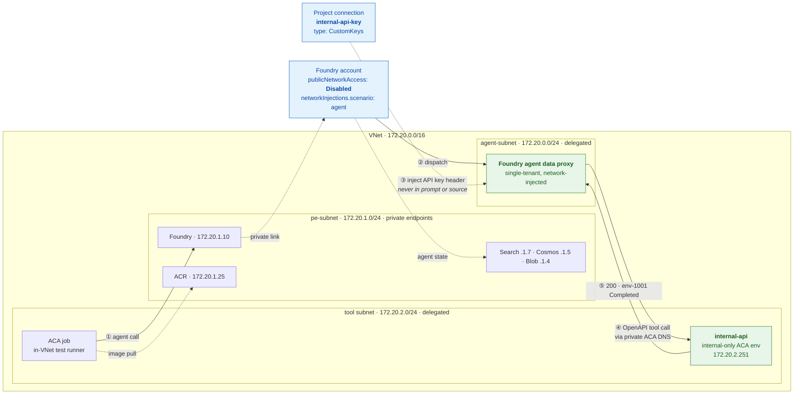
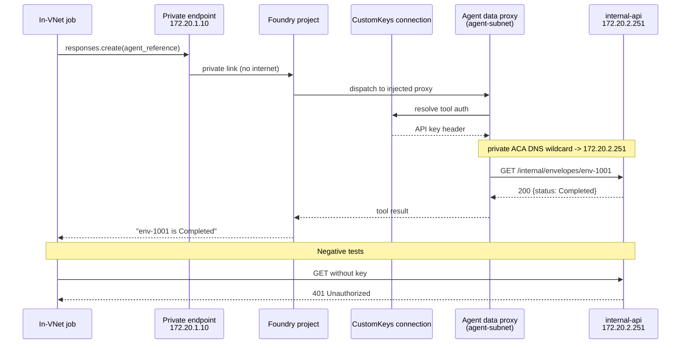
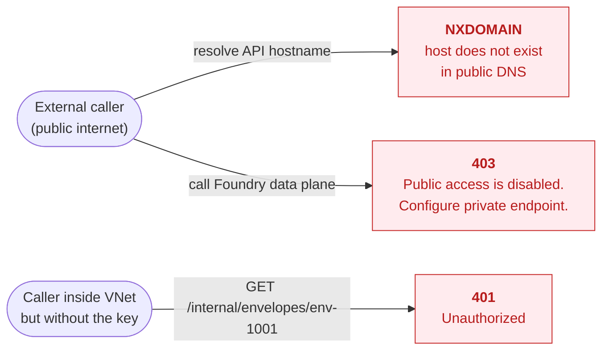

# Foundry Agent Service — measured findings

Consolidated evidence from a hands-on POC that deployed a network-isolated
Foundry Agent Service environment and measured its behaviour.

- **Built:** 2026-08-04 → 08-05 · **Re-validated:** 08-06 · **Demos rehearsed:** 08-07
- **Environment:** two regions, `gpt-4.1`, Standard Agent Setup with network injection
- Everything below was **measured live in Azure**, not sourced from documentation.

> **This file is evidence, not guidance.** For the reusable recommendations
> derived from it, see [`SECURE-AGENT-GUIDELINES.md`](SECURE-AGENT-GUIDELINES.md).
> For the audit trail of how these conclusions were challenged and two of them
> corrected, see [`VALIDATION.md`](VALIDATION.md).

**Redaction.** Subscription IDs, tenant details and resource names are replaced
with placeholders such as `<foundry-account>` and `<subscription-id>`. Log output
is otherwise verbatim. Business data (`env-1001`, `Mutual NDA`) is synthetic test
data from a stub API.

**Measurement caveat.** Figures come from one environment, region and model. They
show **relative** cost and **where time is spent**. Re-measure before using any of
them as an SLA.

---

## Contents

1. [Cold start, idle behaviour and latency](#1-cold-start-idle-behaviour-and-latency)
2. [Private networking and internal API access](#2-private-networking-and-internal-api-access)
3. [Code execution patterns](#3-code-execution-patterns)
4. [Reproducing](#4-reproducing)

---

# 1. Cold start, idle behaviour and latency

## 1.1 Model layer — is there idle de-allocation? **No.**

| Scenario | Latency |
|---|---|
| Cold process, first call (token + TLS + request) | **7.12 s** |
| Entra token acquisition alone | 1.31 s |
| Client construction | 0.04 s |
| Warm steady state (n=11) | **1.97 – 2.94 s** |
| First call after 60 s idle | 2.22 s |
| First call after 5 min idle | 3.04 s |
| First call after **10 min idle** | **3.61 s** |

If models or agents were de-allocated on idle, the 10-minute result would spike.
It does not — 3.61 s versus ~2.3 s warm is **~1.3 s**, within normal
time-to-first-token variance.

**The ~5 s "cold start" on the very first call is client-side**: Entra token
acquisition (1.31 s) plus TLS and connection-pool establishment. It is fixed in
application code by caching the credential/token and reusing a single long-lived
HTTP client. **No Azure change, no cost.**

## 1.2 Sandbox layer — direct measurement, no LLM in the loop

Calling the session-pool data plane directly:

| Pool | Brand-new session | Reused session | Delta |
|---|---|---|---|
| Managed Python pool (warm instances unset) | **0.36 s** | 0.33 s | 0.03 s |
| Managed Python pool (warm instances requested) | **0.37 s** | 0.38 s | −0.01 s |

Server-side execution of `print(1)` took **13 ms**.

**A brand-new session costs ~0.36 s.** There is effectively no sandbox cold start
to eliminate, and therefore no measurable benefit from warming the managed pool.

## 1.3 Warm-instance setting is silently ignored on managed pools

`readySessionInstances` (CLI `--ready-sessions`) is **silently ignored on managed
Python pools** on *every* API version tried — `2025-01-01`, `2026-01-01`,
`2025-10-02-preview`, `2026-03-02-preview` — via both CLI and raw ARM. The
property simply never appears in `scaleConfiguration`. **No error, no warning.**

It **is** honoured on **custom container** pools, where `readySessionInstances: 3`
was accepted and persisted.

> The documented warm-pool knob only does something when you bring your own
> container image — which is also the only case where it is needed, since a
> custom image must be pulled and booted.

The CLI flag is **`--ready-sessions`**. Several docs and snippets show
`--ready-session-instances`, which does not exist.

## 1.4 Custom container pool — capacity matters more than warmth

Measured with `readySessionInstances=3`, `maxConcurrentSessions=10`,
cooldown 300 s:

| Scenario | Result |
|---|---|
| New session, capacity available | **0.40 – 0.63 s** |
| Reused session | 0.30 s |
| New session, pool capacity exhausted | **HTTP 429 / 500 in ~0.3 s** |
| After cooldown expiry | 0.40 – 0.63 s (recovered) |
| Pool provisioning time | **~9 minutes** |

Two findings that matter more than cold start:

1. **Capacity exhaustion fails fast; it does not degrade slowly.** Once
   `maxConcurrentSessions` is reached you get **429/500 immediately** — not a
   slow cold start.
2. **Every distinct session identifier holds a slot for the full cooldown.** With
   `maxConcurrentSessions: 10` and a 300 s cooldown you can start only **10
   distinct sessions per 5 minutes**, even though each call takes 0.4 s. This was
   reproduced exactly: sustained 429s while sessions were held, full recovery
   once the cooldown lapsed.

Size `maxConcurrentSessions` against **arrival rate × cooldown**, and reuse
identifiers per user/thread rather than minting one per call. Pool creation takes
~9 minutes, so this cannot be provisioned on demand.

## 1.5 Built-in Code Interpreter — where the seconds actually go

> **Corrected 2026-08-06.** The original figures used the prompt
> *"Use python to compute sum(range(100))"*. Re-testing proved the model answers
> that **from memory and never calls the tool** (0/6 invocations), so those
> numbers were partly plain model calls. Every figure below asserts a
> `code_interpreter_call` in the response. See [`VALIDATION.md`](VALIDATION.md) §6.

| Scenario | Latency (verified tool execution) |
|---|---|
| Plain model call, no tools (median n=10) | 1.73 s |
| Code interpreter, fresh container each call (median n=8) | **16.40 s** |
| Code interpreter, explicitly reused container (median n=6) | **17.79 s** |
| **Container reuse benefit** | **none** |

Observed spread on individual verified calls: **4.55 s → 103.28 s**.

Reusing the container does **not** help. The cost is the extra LLM round-trips to
author the code, execute it, then summarise the result — the sandbox is not the
bottleneck. The long tail is model-side variance/throttling on shared throughput.

Reliability was measured rather than assumed: one call returned HTTP 400, and
1 of 3 calls in the final in-VNet demo failed with `APITimeoutError` after 90 s.

## 1.6 Provisioned Throughput (PTU) — the tail fix, measured

Measured on a temporary Global Provisioned Managed `gpt-4.1` deployment
(**15 PTU**, the minimum) on the same account, interleaved A/B against the
existing Global Standard deployment so both saw identical conditions. The
deployment was deleted immediately after the run.

**Plain model calls, no tools:**

| Deployment | n | Median | Max |
|---|---:|---:|---:|
| Global Standard | 6 | 1.79 s | 1.97 s |
| **PTU (15)** | 6 | **1.30 s** | **1.45 s** |

**Forced code-interpreter execution — the actual risk:**

| Deployment | Run | n | Median | p90 | Max | Errors |
|---|---|---:|---:|---:|---:|---:|
| Global Standard | 1 | 8 | 30.30 s | 100.08 s | **173.88 s** | 2 |
| Global Standard | 2 | 4 | 15.09 s | 23.82 s | 37.08 s | 2 |
| **PTU (15)** | 1 | 6 | **8.81 s** | 18.66 s | **20.87 s** | 4\* |
| **PTU (15)** | 2 | 5 | **9.50 s** | 22.01 s | 29.91 s | 1 |

\* three were deployment-propagation failures in the first minutes — see below.

**PTU cut the median roughly 2–3x and collapsed the extreme tail from 174 s to
~30 s.** This was the single most effective mitigation measured.

Two honest caveats:

1. **PTU does not eliminate variance.** One PTU call still took 29.91 s and
   another returned HTTP 400 after 71 s. Code-interpreter orchestration
   contributes variance independent of model capacity.
2. **A new PTU deployment is not usable immediately.** For roughly the first two
   minutes every call failed with `400 Bad request for dependent service`.
   Provision ahead of a cutover; do not create it in a failover path.

**Cost** (Azure retail price API, 2026-08-06): Global Provisioned Managed
**$1.00 / PTU / hour**, Regional $2.00, Data Zone $1.10. The 15 PTU minimum is
therefore ~$15/hour (~$10.9k/month) pay-as-you-go, materially cheaper with a
monthly reservation (~$260/PTU/month). A real budget decision, not a free switch.

## 1.7 Answering "can we keep a few main agents always alive?"

The premise does not hold, so the answer is better than expected:

1. **Nothing needs keeping alive at the sandbox layer** — new sessions cost 0.36 s.
2. **Nothing is being de-allocated at the model layer** — 10 minutes idle costs ~1.3 s.
3. **Fix the client**: cache the token, reuse the HTTP client → removes ~5 s from
   the first call.
4. **Fix the tail, not the mean**: the 4.5 s → 103 s spread on verified
   code-interpreter calls is the real risk, and container reuse does not reduce it.
5. **Reduce round-trips**: every tool hop is a full LLM turn. Fewer, coarser tools
   beat warming.
6. With a **custom container** pool, warm instances genuinely matter — and are
   billed while idle.
7. **Size for concurrency, not warmth.** The only hard failure reproduced was
   concurrent-session exhaustion.

There is still **no documented min-replica/keep-warm control for the prompt-agent
data proxy** — an open question for the product group — but the data shows no
user-visible penalty from its absence.

---

# 2. Private networking and internal API access

## 2.1 Result

**Passed end to end.** A Foundry prompt agent called an API that has **no public
DNS record**, hosted in an internal-only Azure Container Apps environment, from a
Foundry account with `publicNetworkAccess: Disabled`. The tool authenticated with
an API key stored in a Foundry project connection — never in the prompt or source.

```text
Envelope: env-1001
Status: Completed
Document Name: Mutual NDA
RESULT=PASSED
```

## 2.2 Architecture

Addresses below are the **actual deployed values**, read back from Azure, with
resource names redacted.



### Request path



### Proven isolation



Network reachability and application authentication are enforced
**independently** — being inside the VNet is not sufficient to read data.

## 2.3 Deployed configuration

| Component | Configuration |
|---|---|
| Foundry account | public access disabled, network-injected |
| Agent subnet | `172.20.0.0/24`, delegated to `Microsoft.App/environments` |
| Private endpoint subnet | `172.20.1.0/24` |
| Tool subnet | `172.20.2.0/24`, delegated to `Microsoft.App/environments` |
| ACA environment | internal-only, static IP `172.20.2.251` |
| Private API | internal-only ACA app, no public ingress |
| Authentication | API key header from a Foundry `CustomKeys` connection |
| Runtime identity | user-assigned MI: `Foundry User` + `AcrPull` |
| Container registry | public access disabled, private endpoint |

### Why private DNS matters

Name resolution is what makes the isolation work — the API host simply does not
exist in public DNS.

| Private DNS zone | Resolves to |
|---|---|
| `privatelink.services.ai.azure.com` | `172.20.1.10` |
| `privatelink.search.windows.net` | `172.20.1.7` |
| `privatelink.documents.azure.com` | `172.20.1.5` |
| `privatelink.blob.core.windows.net` | `172.20.1.4` |
| `privatelink.azurecr.io` | `172.20.1.25` |
| ACA environment zone (wildcard) | `172.20.2.251` |

## 2.4 Evidence

**Positive private tool call** — in-VNet job logs:

```text
PRIVATE_API_HEALTH={"status":"ok","visibility":"private-vnet-only",...}
AGENT_RESPONSE=The current status of envelope env-1001 is Completed
RESULT=PASSED: private OpenAPI tool returned the internal envelope status
```

Matching authenticated request in the API logs:

```text
GET /internal/envelopes/env-1001 HTTP/1.1 200 OK
```

**Authentication negative test** — same runner, no credentials:

```text
UNAUTHENTICATED_REQUEST=BLOCKED_401
GET /internal/envelopes/env-1001 HTTP/1.1 401 Unauthorized
```

The subsequent agent call returned 200, proving the Foundry connection supplied
the key.

**Network negative tests** — from outside the VNet:

```text
Could not resolve host: internal-api.<aca-env>.<region>.azurecontainerapps.io

403 Public access is disabled. Please configure private endpoint.
```

## 2.5 Deployment issue and workaround

The primary region returned `InsufficientResourcesAvailable` for a new Standard
Azure AI Search service. Search was created in a **second region** with public
access disabled, then attached to the Foundry account through a private endpoint
in the Foundry account's region. Standard Agent Setup supports cross-region
backing resources.

> **Setup guidance** — the create-time checklist, subnet/DNS requirements, and
> guidance for on-premises or cross-network APIs now live in
> [`SECURE-AGENT-GUIDELINES.md`](SECURE-AGENT-GUIDELINES.md) Parts 1 and 2.

---

# 3. Code execution patterns

Three execution patterns were built and compared: a controlled custom container
session, the built-in Code Interpreter, and a Foundry agent driving a managed
Python session pool through MCP.

## 3.1 Measured comparison

| Pattern | Test | End-to-end | Result |
|---|---|---:|---|
| Custom container, direct | Approved packages | **0.57 s** | Passed |
| Custom container, direct | Internet egress | **0.08 s** | Blocked |
| Custom container, direct | File data URI | **0.22 s** | Passed |
| Built-in Code Interpreter | Forced Python execution (n=3) | **5.94 s median** | 2/3 passed, 1 timeout |
| Managed pool via MCP agent | Python calculation | **2.85 s** | Passed |
| Managed pool via MCP agent | Internet egress | **2.67 s** | Blocked |

Re-measured 2026-08-06 using the documented `/executions` data-plane contract.
See §1.5 for the larger verified built-in sample (median 16.40 s, range
4.55–103.28 s) and the methodology correction behind it.

## 3.2 Controlled custom image

Derived from Microsoft's code-interpreter runtime with pinned packages:

```text
polars=1.32.3   pyarrow=21.0.0   matplotlib=3.10.5
```

Runtime proof:

```text
PACKAGES_OK polars=1.32.3 pyarrow=21.0.0 matplotlib=3.10.5 rows=3
EGRESS_BLOCKED URLError
FILE_DATA_URI_OK data:text/csv;base64,...
```

Pool configuration: `EgressDisabled`, `maxConcurrentSessions: 5`,
`readySessionInstances: 2`, 600 s cooldown, 1 vCPU / 2 GiB per session.

Reused-session execution took 0.06–0.57 s; server-side Python work itself took
6–263 ms.

> **Build trap.** The code-interpreter base image runs as root. Adding a
> non-root `USER` directive caused the pool to fail to start.

## 3.3 Warm-pool contract

Custom container pools **reject** `readySessionInstances: 0`:

```text
SessionPoolInvalidReadySessionInstances:
Supported values should be greater than 0 and smaller than maxConcurrentSessions.
```

A custom pool must therefore keep at least one warm instance — "keep the agents
alive" is effectively built into the pool contract, with an associated idle cost.
Managed Python pools behave differently: the setting is silently omitted (§1.3),
and new sessions cost ~0.36 s anyway.

## 3.4 Capacity behaviour

Each new session identifier consumes a concurrent-session slot for the full
cooldown period. During API discovery, creating multiple identifiers exhausted
the five-session pool and returned `429`. Applications should reuse one
identifier per user or conversation, size `maxConcurrentSessions` against
arrival rate × cooldown, and handle `429` explicitly rather than treating it as
a slow cold start.

## 3.5 Custom container MCP gap — escalation-worthy

> Re-validated 2026-08-06 — see [`VALIDATION.md`](VALIDATION.md) §3. The original
> evidence used PATCH, which is out of contract. Re-tested properly via PUT and
> **upheld with high confidence**.

The `Microsoft.App/SessionPoolsSupportMCP` feature was `Registered`. Even so, MCP
could not be enabled on a custom container pool. The decisive test removed every
variable — Microsoft's own sample image, the newest *published* preview API
version, and the documented create path:

```text
PUT .../sessionPools/<name>?api-version=2025-10-02-preview
  image: mcr.microsoft.com/k8se/services/codeinterpreter:0.9.18-python3.12
  containerType: CustomContainer
  mcpServerSettings: { isMcpServerEnabled: true }

-> 201 Created
-> provisioningState: Succeeded
-> GET returns "mcpServerSettings": null

POST .../fetchMCPServerCredentials
-> 400 SessionMCPServerNotEnabled
```

An identical call against a managed Python pool returns `200 {"apiKey": ...}`.

This **contradicts Microsoft's published material**, which is what makes it
escalation-worthy rather than a misconfiguration:

- The ACA MCP overview states the platform-managed MCP server exposes its tools
  "regardless of the session pool's `containerType`".
- The Foundry custom-code-interpreter sample provisions
  `containerType: 'CustomContainer'` *with* `mcpServerSettings.isMcpServerEnabled: true`.

The property is also annotated `@removed(Versions.v2026_01_01)` in the published
spec, so MCP is absent from the stable `2026-01-01` contract entirely. Automation
needing MCP must pin `2025-10-02-preview`. **Do not pin `2026-03-02-preview`**:
the resource provider advertises it, but it is not published in
`azure-rest-api-specs` and is therefore unsupportable.

Managed Python pools expose MCP successfully, so the agent-side demonstration
used one through a `RemoteTool` project connection.

> **Prompt trap.** MCP session identifiers must be 4–128 characters. In one run
> the model chose `1`, causing `InvalidLengthOfSessionIdentifier`. Explicitly
> instructing the agent to reuse a fixed identifier made the demo deterministic.
> Production prompts should specify identifier format and tool-call order.

---

# 4. Reproducing

```bash
./preflight.sh          # verifies identity, subscription and every demo resource
./track-b/run-demo.sh   # ~54 s — private internal API access
./track-c/run-demo.sh   # ~96 s — controlled code execution
```

Individual probes:

```bash
.venv/bin/python probes/probe_idle.py                     # model idle / de-allocation
.venv/bin/python probes/ci_verify.py                      # verified code-interpreter latency
.venv/bin/python probes/ci_reuse.py                       # fresh vs reused container
.venv/bin/python probes/ptu_ab.py                         # PTU vs Standard A/B
.venv/bin/python probes/pool_exec.py <pool-a> <pool-b>    # direct sandbox timing
```

**Prerequisites**

- Role `Azure ContainerApps Session Executor` on the pool's resource group.
- Callers must run **inside the VNet** — the Foundry data plane is private.
- The PTU probe creates a billable deployment. Read the cost note in §1.6 first.

**API version note.** The session-pool data plane accepts `/executions`,
`/execute` and `/code/execute` across all advertised API versions. Earlier
testing that suggested only `2024-02-02-preview` worked was an artefact of an
out-of-contract request body — see [`VALIDATION.md`](VALIDATION.md) §4.
