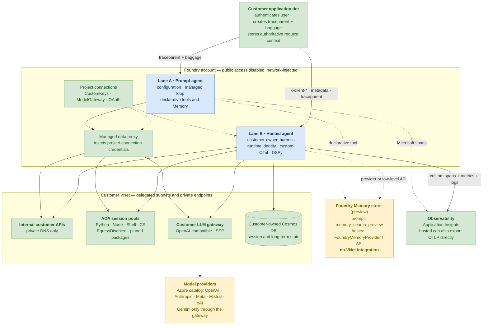
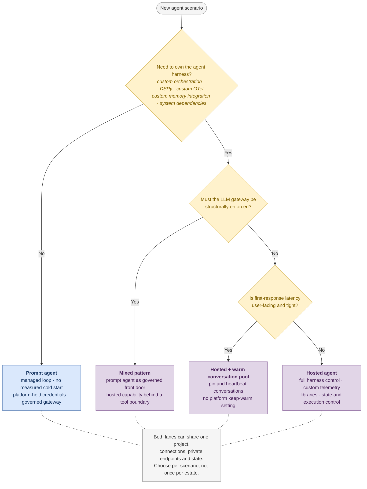

# Azure AI Foundry Agent Service — enterprise POC

A hands-on evaluation of **prompt agents** and **hosted agents** against common
enterprise requirements: private API access, cold start, code execution,
request context, LLM gateways, telemetry, library integration, memory and IP
protection.

- **Measured:** August 2026
- **Environment:** Standard Agent Setup, network injection,
  `publicNetworkAccess=Disabled`, two Azure regions
- **Evidence labels:** **[Measured]** = observed live; **[Documented]** =
  supported by current product documentation; **[Unknown]** = not established

Figures come from one environment and are not an SLA. Account, project,
subscription and customer names are redacted; business records are synthetic.

## Where to start

| Need | Document |
|---|---|
| Customer-facing requirement comparison and architecture decisions | [`HOSTED-VS-PROMPT-AGENTS.md`](HOSTED-VS-PROMPT-AGENTS.md) |
| Raw prompt-agent measurements and reproduction steps | [`FINDINGS.md`](FINDINGS.md) |
| Standalone secure deployment guidance | [`SECURE-AGENT-GUIDELINES.md`](SECURE-AGENT-GUIDELINES.md) |
| 60-minute demonstration flow | [`DEMO-RUNBOOK.md`](DEMO-RUNBOOK.md) |
| Hosted-agent scripts and source variants | [`track-d/README.md`](track-d/README.md) |

`HOSTED-VS-PROMPT-AGENTS.md` is the source of truth for capability decisions.
The other documents either provide evidence, reusable guidance or execution
instructions; they do not repeat the full comparison.

## Requirement summary

| Requirement | Prompt agent | Hosted agent | Design decision |
|---|---|---|---|
| Private internal APIs | Managed data proxy injects connection credentials | Agent code resolves credentials with its runtime identity | Both work; hosted requires explicit RBAC |
| Cold start | No measurable idle de-allocation penalty | ~15 s to create a session; first serving turn can be much slower | Prompt for latency-sensitive entry points |
| Agent harness control | Foundry-managed loop | Customer-owned framework and orchestration | Hosted when custom execution control is required |
| Code execution | Code Interpreter or ACA session pool | Trusted code in-process; untrusted code in an ACA session pool | Never run model-generated code in the agent process |
| Request context | `traceparent` and small W3C `baggage` reach tools | Also receives `x-client-*` headers and `metadata` | Neither provides generic OBO to arbitrary APIs |
| Existing LLM gateway | Admin-owned `ModelGateway` connection | Agent sets `base_url` directly | Prompt provides structural governance; hosted needs egress policy |
| Custom telemetry | Microsoft spans correlated to the caller trace | Custom spans, metrics and logs; direct OTLP export | Hosted for in-agent telemetry injection |
| DSPy and arbitrary packages | Not inside the managed loop | Runs in the hosted environment | Hosted |
| Filesystem memory | Not applicable | Conversation-scoped writable disk | Cache only; not long-term memory |
| Foundry Memory (preview) | Declarative `memory_search_preview` tool | `FoundryMemoryProvider` or direct Memory Store API | Both supported; Memory does not support VNet integration |
| Customer-owned long-term state | External tool/API | Direct SDK access with runtime identity | Private Cosmos pattern measured |
| IP protection | Customer-owned backing stores; tracing can capture prompt text | Same, plus hosted source bundle/image and agent-owned state | Treat telemetry and source artifacts as part of the IP boundary |

## Reference architecture

Both lanes can coexist in one project and share private endpoints, project
connections, session pools, the LLM gateway and customer-owned state.



### Boundaries to make explicit

1. **Gateway governance differs by lane.** A prompt agent uses an admin-owned
   `ModelGateway` connection. Hosted code can select any reachable endpoint, so
   mandatory gateway routing requires subnet egress controls.
2. **Context is not authorization.** Headers, metadata and baggage are
   caller-supplied. Authoritative identity/tenant context belongs in a
   server-side store; delegated API access requires Toolbox/OAuth or a token
   broker.
3. **Untrusted code requires a separate sandbox.** Hosted in-process execution
   shares the agent identity, environment and network. Model-generated or
   user-supplied code goes to an ACA session pool from either lane.
4. **Managed Memory is outside the private-network guarantee.** Foundry Memory
   supports both lanes, but the preview service does not support VNet
   integration. Use customer-owned storage where a fully private data path is
   mandatory.

## Choosing a lane per scenario



## Foundry Memory requirements

Prompt and hosted integrations use the same Memory Store service:

| Agent type | Integration |
|---|---|
| Prompt agent | Add `MemorySearchPreviewTool` to the agent definition |
| Hosted agent using Microsoft Agent Framework | Add `FoundryMemoryProvider` as a context provider |
| Hosted agent using another framework | Call the low-level Memory Store API with an explicit scope |

The identity provisioning or calling the store and the hosted-agent runtime
identity each require **Foundry User** and **Cognitive Services OpenAI User** at
the project scope. The latter permits memory extraction and embedding calls.

This POC measured store creation from the locked-down VNet in 1.08 s and store
listing from a hosted sandbox in 204–391 ms. Microsoft documents cross-session
recall and per-user scoping, but those behaviours were not independently
benchmarked here. Memory is public preview and does not support VNet
integration.

Official references:

- [Give a hosted agent persistent memory](https://learn.microsoft.com/azure/foundry/agents/quickstarts/quickstart-memory-hosted-agent)
- [Create and use memory in Foundry Agent Service](https://learn.microsoft.com/azure/foundry/agents/how-to/memory-usage)

## Running the POC

```bash
./preflight.sh          # identity, subscription and deployed-resource checks
./track-b/run-demo.sh   # private internal API access
./track-c/run-demo.sh   # code-execution comparison
```

Hosted-agent data-plane operations must run inside the VNet:

```bash
export AZ_SUBSCRIPTION=<subscription-id>
./track-d/run-in-vnet.sh inspect_agent.py
```

The scripts reference the live deployment they were built against and must be
re-pointed before reuse in another environment. No customer-identifying names
are committed; telemetry uses the neutral `customer.*` namespace and business
records are synthetic.
