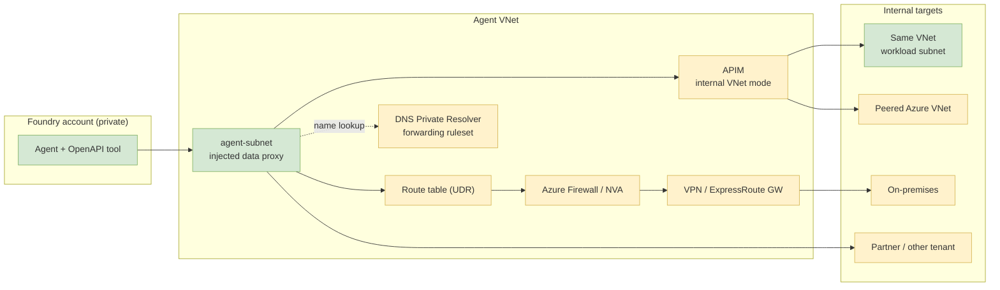

# Deploying Azure AI Foundry agents securely in the enterprise

A practical guideline for teams putting **Foundry Agent Service into production
inside a private network**, where agents must reach internal APIs and systems,
meet latency targets, and execute code under controlled conditions.

It is organised as four independent decisions:

| Part | Decision |
|---|---|
| [Part 1](#part-1--the-secure-foundry-foundation) | How to build the secure, VNet-protected foundation |
| [Part 2](#part-2--reaching-your-internal-apis-and-resources) | How agents reach your internal APIs and resources |
| [Part 3](#part-3--latency-and-throughput) | Where latency actually comes from, and what fixes it |
| [Part 4](#part-4--code-execution-patterns) | How to run agent-generated code safely |

Parts 1 and 2 are prerequisites for a private deployment. Parts 3 and 4 apply
whether or not you use network isolation.

## How to read the evidence tags

The guidance below combines a hands-on reference deployment with Microsoft
documentation. The two are not equally strong, so every non-obvious claim is
tagged:

| Tag | Meaning |
|---|---|
| **[Verified]** | Deployed and measured hands-on in a reference environment |
| **[Documented]** | Stated in Microsoft documentation; not independently exercised |
| **[Inferred]** | Follows from platform semantics, but **no explicit support statement exists** — validate before production |

Treat **[Inferred]** items as design risks to retire during a pilot, not as
settled facts. Measured figures come from a single environment, region and model
and are included to show **relative** cost and **where time is spent** — re-measure
in your own environment before committing to an SLA.

---

## The distinction that governs Part 1

Two categories of dependency get conflated constantly, and the difference
decides what is actually negotiable:

### Platform dependencies — fixed, not examples

Azure **Storage**, **Cosmos DB**, and **AI Search** are not illustrative choices.
For Standard Agent Setup they *are* the agent runtime's own state:

| Resource | What the agent runtime uses it for |
|---|---|
| Cosmos DB | Thread / conversation state |
| Storage | File and artifact storage |
| AI Search | Vector store for file search |

The documentation is explicit: *"You can't create a secured standard agent in
Foundry without all three resources provided."*
([ref](https://learn.microsoft.com/en-us/azure/foundry/agents/how-to/virtual-networks#deployment-errors))

You choose the *instances*, region, SKU and network posture. You do not choose
whether they exist. Substituting your own database for Cosmos is not an option,
and any plan that assumes otherwise fails at deployment time.

### Business dependencies — fully variable

Everything the agent *reaches on your behalf*: internal REST APIs, line-of-
business databases, mainframes, on-premises services, SaaS. This is the
genuinely variable surface, and it is the subject of Part 2.

> **Part 1 is a fixed contract you comply with. Part 2 is an architecture you
> design.**

---

# Part 1 — The secure Foundry foundation

Applies to every deployment. Steps 1–3 are **create-time decisions** that are
expensive or impossible to reverse.

### Step 1 — Create the Foundry account network-injected [Verified]

```jsonc
// Microsoft.CognitiveServices/accounts  (kind: AIServices)
{
  "identity": { "type": "SystemAssigned" },
  "properties": {
    "publicNetworkAccess": "Disabled",
    "customSubDomainName": "<globally-unique>",   // required for private endpoint DNS
    "networkInjections": [{
      "scenario": "agent",
      "subnetArmId": "<agent-subnet resource id>",
      "useMicrosoftManagedNetwork": false          // false = inject into YOUR VNet
    }]
  }
}
```

`useMicrosoftManagedNetwork: false` is the switch that places the agent data
proxy inside your VNet. Set to `true`, Microsoft hosts the network and this
entire guideline does not apply.

> **Cannot be retrofitted.** Network injection must be present at account
> creation. A public account that has been used for prototyping is a **rebuild**,
> not a settings change. Budget for this. Account and VNet must be in the same
> region.
> ([ref](https://learn.microsoft.com/en-us/azure/foundry/agents/how-to/virtual-networks#limitations))

### Step 2 — Lay out the VNet [Verified]

Minimum three subnets. A fourth and fifth appear in Part 2 if you need hybrid
DNS or egress inspection.

| Subnet | Delegation | Sizing | Purpose |
|---|---|---|---|
| Agent subnet | `Microsoft.App/environments` | **/27 min, /24 recommended** | Foundry data proxy injection target |
| Private endpoint subnet | none | /27+ | PEs for Foundry and platform dependencies |
| Workload subnet | depends on host | sized to workload | Your APIs/tools, if VNet-hosted |

Hard constraints:

- Agent subnet is **dedicated to one Foundry resource**. Do not share it.
- **RFC1918 only.** Public and CGNAT ranges are rejected.
- Must not overlap anything it will ever peer with — including future
  acquisitions and partner networks. Plan address space generously now.
- Avoid Azure-reserved ranges: `169.254.0.0/16`, `172.30.0.0/16`,
  `172.31.0.0/16`, `192.0.2.0/24`, and several `100.100.x.x` ranges.
- Class-A `10.x.x.x` support varies by region — confirm for your target region.

> The portal does not surface delegated-subnet IP utilization. A /27 that
> silently exhausts is a hard failure mode. Use /24.

### Step 3 — Private endpoints and private DNS zones [Verified]

Foundry creates **only its own** private endpoint. Platform-dependency PEs are
**not auto-created** — this is the single most common deployment failure.

| Resource | `groupId` | Private DNS zone |
|---|---|---|
| Foundry account | `account` | `privatelink.services.ai.azure.com`, `privatelink.openai.azure.com`, `privatelink.cognitiveservices.azure.com` |
| AI Search | `searchService` | `privatelink.search.windows.net` |
| Cosmos DB (SQL) | `Sql` | `privatelink.documents.azure.com` |
| Storage (blob) | `blob` | `privatelink.blob.core.windows.net` |
| Container Registry | `registry` | `privatelink.azurecr.io` |
| Monitor / App Insights | `azuremonitor` (via AMPLS) | `privatelink.monitor.azure.com`, `privatelink.oms.opinsights.azure.com`, `privatelink.ods.opinsights.azure.com`, `privatelink.agentsvc.azure-automation.net` |

Each zone must be **linked to the VNet**. Foundry needs all three of its zones —
the account is reachable under multiple hostnames and partial configuration
produces intermittent, hard-to-diagnose failures.

Reference:
[DNS zone configuration summary](https://learn.microsoft.com/en-us/azure/foundry/agents/how-to/virtual-networks#dns-zone-configurations-summary)
· [Private endpoint DNS](https://learn.microsoft.com/en-us/azure/private-link/private-endpoint-dns)

### Step 4 — Provision the platform dependencies [Verified]

All three, all with public access disabled, all reachable privately.

**They may live in another region.** A reference deployment placed AI Search in a different region from the
Foundry account (the primary region had no Standard Search capacity) and
attached it through a private endpoint in the Foundry account’s region. Useful escape hatch for
capacity constraints — at the cost of cross-region latency and egress.

### Step 5 — Capability hosts [Verified]

The most-missed resource. Two of them, at two different scopes:

```
accounts/<account>/capabilityHosts/<name>
  capabilityHostKind: Agents
  customerSubnet: <agent-subnet resource id>      <-- binds agents to the VNet

accounts/<account>/projects/<project>/capabilityHosts/<name>
  capabilityHostKind: Agents
  storageConnections:       [<storage connection>]
  threadStorageConnections: [<cosmos connection>]
  vectorStoreConnections:   [<search connection>]
```

Without these the account looks correctly configured and agents still fail.

### Step 6 — RBAC for the project managed identity [Verified]

| Role | Scope |
|---|---|
| Storage Blob Data Contributor | Storage account |
| Storage Blob Data Owner | Project blob containers |
| Cosmos DB Operator | Cosmos account |
| Cosmos SQL built-in data role `...0002` | `enterprise_memory` database |
| Search Index Data Contributor | AI Search |
| Search Service Contributor | AI Search |
| AcrPull | ACR (custom container tools only) |

Prefer managed identity over keys everywhere the service supports it. In the reference deployment all four platform connections used
`authType: AAD`; only the legacy internal business API required a key.

### Step 7 — Plan human and CI access [Verified]

With `publicNetworkAccess: Disabled` the **data plane is private too**. Anything
that talks to the agent must be inside the network or privately connected:

- VNet-hosted compute (for example a Container Apps job)
- Self-hosted CI/CD agents
- VPN / ExpressRoute for developers
- Azure Bastion for jump-box access

This routinely surprises teams mid-project. Decide it during design.

### Foundation checklist

- [ ] Account created with `networkInjections` — **not** retrofitted
- [ ] `publicNetworkAccess: Disabled` and `customSubDomainName` set
- [ ] Agent subnet delegated to `Microsoft.App/environments`, /24, dedicated
- [ ] Address space RFC1918 and non-overlapping with all current/future peers
- [ ] Private endpoints for Foundry **and** all three platform dependencies
- [ ] All private DNS zones created **and VNet-linked**
- [ ] Account-level capability host with `customerSubnet`
- [ ] Project-level capability host with all three store connections
- [ ] Project MI role assignments complete
- [ ] Private access path for humans and CI decided

---

# Part 2 — Reaching your internal APIs and resources

**Part 1 does not change based on any of this.** The agent subnet is an ordinary
VNet subnet — in the reference deployment it carried an NSG and standard routing, with nothing
preventing a route table. Everything below is normal Azure networking applied to
that subnet.

Two independent problems, in this order: **can the packet get there** (routing),
and **does the name resolve** (DNS). DNS is the one that bites.



Green = verified hands-on. Yellow = documented patterns, not measured here.

## 2.1 Connectivity patterns

| Target location | Pattern | Status |
|---|---|---|
| Same VNet, different subnet | Direct — nothing extra | **[Verified]** |
| Another Azure VNet | VNet peering | **[Documented]** — supported; address spaces must not overlap ([ref](https://learn.microsoft.com/en-us/azure/foundry/agents/how-to/virtual-networks#can-i-use-peered-virtual-networks-or-place-resources-in-different-virtual-networks)) |
| Azure PaaS (SQL, Cosmos, Storage, Key Vault…) | Private endpoint + private DNS zone | **[Documented]** |
| On-premises | ExpressRoute Private Peering or Site-to-Site VPN into the agent VNet or a peered hub | **[Inferred]** |
| Partner / other tenant | Private Link Service | **[Documented]** |
| Egress must be inspected | Route table on agent subnet, `0.0.0.0/0` → virtual appliance | **[Documented]** for ACA workload profiles; **[Inferred]** for the Foundry proxy specifically |

Peering, ExpressRoute and Private Link are standard hub-and-spoke. Nothing about
Foundry makes them special — the agent subnet participates in normal Azure route
selection.

## 2.2 DNS — plan this first, not last

Azure Private DNS zones **do not resolve on-premises names**. If your API is
`api.internal.contoso.com` and only corporate DNS knows it, private endpoints
solve nothing.

Documented pattern
([ref](https://learn.microsoft.com/en-us/azure/dns/private-resolver-hybrid-dns)):

1. Establish routing to on-prem DNS servers over VPN/ExpressRoute.
2. Deploy **Azure DNS Private Resolver** with an outbound endpoint in a subnet
   delegated to `Microsoft.Network/dnsResolvers`.
3. Create a forwarding ruleset: `internal.contoso.com.` → on-prem DNS IPs.
4. **Link the ruleset to the agent VNet.**
5. **Leave the VNet on Azure-provided DNS.** The tutorial warns explicitly:
   *"Don't change the DNS settings for your virtual network to use the inbound
   endpoint IP address."*

The reference VNet ran Azure-provided DNS (`dnsServers: []`) plus private
zones — the same resolution model this extends. **[Verified]** for the base model;
**[Inferred]** that the injected data proxy honors forwarding rulesets.

If you must use custom DNS servers instead, forward unresolved queries to
`168.63.129.16` or private endpoint resolution breaks.

## 2.3 Authentication to internal resources

Preference order:

1. **Managed identity + Entra** — best. No secret exists.
2. **OAuth on-behalf-of** — when the call must carry end-user identity.
   ([ref](https://learn.microsoft.com/en-us/entra/identity-platform/v2-oauth2-on-behalf-of-flow))
3. **API key / custom header via a Foundry project connection** — the realistic
   fallback for legacy systems. **[Verified]**

Never place credentials in the agent's prompt, instructions, or source. Use a
Foundry connection; the data proxy injects it at call time:

```python
auth = OpenApiProjectConnectionAuthDetails(
    security_scheme=OpenApiProjectConnectionSecurityScheme(connection_id=conn_id)
)
tool = OpenApiTool(name="internal_api", spec=spec, auth=auth, ...)
```

([OpenAPI tool reference](https://learn.microsoft.com/en-us/azure/foundry/agents/how-to/tools/openapi))

For legacy systems with no modern auth, terminate authentication at a gateway
(2.4) rather than teaching the agent a bespoke scheme.

## 2.4 Recommended shape: gateway-fronted internal access

For anything beyond one or two APIs, put **API Management in internal VNet mode**
in the agent VNet as the single private ingress to all internal resources.
([ref](https://learn.microsoft.com/en-us/azure/api-management/api-management-using-with-internal-vnet))

Why this scales better than per-API wiring:

- Foundry targets **one stable private hostname**, regardless of whether the
  backend is same-VNet, peered, on-prem, or SaaS. Backend moves become invisible.
- Hybrid routing and DNS complexity is solved **once**, at the gateway.
- Centralized throttling, quotas, audit logging, and request/response shaping.
- One place to manage OpenAPI specs — which agents consume directly.
- Credential translation: APIM holds the legacy credential; the agent uses
  managed identity to reach APIM.
- Agent-hostile backends (chatty, unbounded responses) can be reshaped in policy
  instead of burning context.

Cost: another component to operate and pay for. Below ~3 internal APIs, direct
connection is defensible.

## 2.5 Egress control — two traps

**Do not enable TLS inspection on the agent path.** Foundry docs call this out
directly: a self-signed inspection certificate breaks managed-identity token
acquisition, and there is **no documented way** to install a corporate root CA
into the managed data proxy. Exempt the agent subnet from inspection policy.

**"No public egress" does not mean zero dependencies.** If firewalling egress,
allow at minimum:

- Service tag `AzureActiveDirectory`, or the managed-identity FQDNs
  `*.identity.azure.net`, `login.microsoftonline.com`,
  `*.login.microsoftonline.com`, `*.login.microsoft.com`
- Container platform FQDNs (`mcr.microsoft.com`, `*.data.mcr.microsoft.com`, …)
- DNS to `168.63.129.16:53`

There is **no single authoritative "all FQDNs a Foundry agent needs" list**.
Treat locked-down egress as an iterative exercise: start permissive with full
logging, tighten from observed traffic, and do not enforce a restrictive policy
for the first time in production.
([ACA firewall integration](https://learn.microsoft.com/en-us/azure/container-apps/use-azure-firewall))

## Connectivity checklist

- [ ] Target inventory: every internal resource, where it lives, how it authenticates
- [ ] Routing path chosen per target (peering / PE / ExpressRoute / Private Link)
- [ ] **DNS resolution path proven for every hostname** — from inside the VNet
- [ ] DNS Private Resolver + ruleset deployed and VNet-linked (if hybrid)
- [ ] Auth method chosen; credentials in Foundry connections, never in prompts
- [ ] Gateway decision made (APIM internal mode vs direct)
- [ ] TLS inspection explicitly **disabled** for the agent subnet
- [ ] Egress allowlist covers Entra + platform FQDNs, validated under logging
- [ ] Negative tests run: unauthenticated call, external DNS, external data plane

---

# Part 3 — Latency and throughput

Perceived "slowness" in agent applications is routinely misattributed. Measuring
each layer separately is what turns it into a solvable problem.

## 3.1 Where the time actually goes

Measured on a reference deployment. **Your absolute numbers will differ** — the
value here is the relative breakdown. **[Verified]**

| Layer | Typical contribution | Fix |
|---|---|---|
| First-call client overhead | ~5 s once per process | Cache the credential, reuse one long-lived HTTP client — **code change, no cost** |
| Entra token acquisition | ~1.3 s (first call only) | Same as above |
| Warm model call, no tools | ~2 s | Model/deployment choice |
| Sandbox session start | **~0.4 s** | Nothing to fix — already negligible |
| Agent + tool round-trips | **~16 s median, long tail** | Prompt/tool design and throughput mode |

Two conclusions that change designs:

**There is no idle de-allocation of models or agents. [Verified]** Latency after
10 minutes idle was ~3.6 s versus ~2.3 s warm — normal variance, not a cold
start. Designs built around "keep-alive pings" to prevent de-allocation solve a
problem that does not exist.

**The sandbox is not the bottleneck. [Verified]** A brand-new session costs
~0.4 s. Tool-based slowness is dominated by the extra LLM round-trips to author
code, execute it, and summarise the result.

> **Beware of benchmarks that never invoke the tool.** A prompt like
> *"use Python to compute sum(range(100))"* is answered from memory — measured
> **0/6** actual tool invocations. Always assert that a tool call appears in the
> response before trusting a latency number. This single error made an early
> round of measurements meaningless.

## 3.2 The real risk is the tail, not the median

On shared/pay-as-you-go throughput, verified tool-executing calls ranged from
**~4.5 s to ~103 s**, with occasional HTTP 400s and client timeouts.
**Provision for the tail and the error rate, not the median.**

## 3.3 Mitigations, in the order worth trying

1. **Fix client-side overhead first.** Credential/token caching and connection
   reuse. Free, and removes the entire first-call penalty.
2. **Reduce round-trips.** Fewer, better-scoped tools; avoid chatty tool designs;
   constrain output size. Each avoided round-trip removes seconds.
3. **Set explicit timeouts and retries** with jittered backoff. Tool-executing
   calls *will* occasionally fail — treat that as normal, not exceptional.
4. **Consider Provisioned Throughput (PTU)** if tail latency is the binding
   constraint. In an interleaved A/B against shared throughput, PTU cut the
   median roughly 2–3x and collapsed the worst case from ~174 s to ~30 s.
   **[Verified]** It narrows variance; it does not eliminate it.
5. **Stream responses** so users see progress rather than a spinner.

PTU carries a substantial fixed minimum commitment and is billed for reserved
capacity whether used or not. Justify it with a measured tail problem, and size
it against measured throughput.
([Provisioned throughput](https://learn.microsoft.com/en-us/azure/ai-foundry/openai/concepts/provisioned-throughput)
· [Onboarding](https://learn.microsoft.com/en-us/azure/ai-foundry/openai/how-to/provisioned-throughput-onboarding)
· [Latency guidance](https://learn.microsoft.com/en-us/azure/ai-foundry/openai/how-to/latency))

## Performance checklist

- [ ] Credential and HTTP client cached and reused across calls
- [ ] Latency measured **per layer**, not end-to-end only
- [ ] Tool invocation asserted in any benchmark that claims to measure tools
- [ ] p95/p99 and error rate captured — not just the median
- [ ] Explicit timeouts, retries and backoff implemented
- [ ] Throughput mode chosen against measured data
- [ ] Streaming used for user-facing flows

---

# Part 4 — Code execution patterns

If agents generate and run code, decide deliberately how much control you need.
Three options, in increasing order of control and operational burden.

| | Built-in Code Interpreter | Managed session pool | Custom container pool |
|---|---|---|---|
| Package versions | Platform-controlled | Platform-controlled | **You pin them** |
| Network egress | Platform-controlled | Configurable | **Explicitly disabled** |
| Startup | n/a | ~0.4 s | Image pull + boot |
| Warm instances | Not exposed | Not honoured | **Honoured and sized by you** |
| Observed latency | ~6–103 s via agent | ~2.7 s via agent | **Sub-second direct** |
| Operational burden | Low | Low | Image, capacity, lifecycle, cost |

All figures **[Verified]** in one environment; re-measure before relying on them.

**Choosing:**

- **Built-in** — low-volume, non-critical convenience work. Accept variable
  latency and occasional failures.
- **Managed pool** — server-side execution without custom packages.
- **Custom container** — when you need deterministic package versions,
  guaranteed egress isolation, or predictable latency. Regulated environments
  usually land here.

## 4.1 Guidance for custom container pools

- **Pin every dependency** in the image. Reproducibility is the main reason to
  take on this burden — a floating tag discards the benefit.
- **Disable egress explicitly** rather than assuming isolation. Then *test* it:
  a blocked outbound call should fail fast. **[Verified]**
- **Don't override the base image's user.** Adding a non-root `USER` to the
  code-interpreter base image caused the pool to fail to start. **[Verified]**
- **Size warm instances deliberately.** Unlike the managed pool, warm instances
  *are* honoured here — and are genuinely needed, since a custom image must be
  pulled and booted.
- **Expect fail-fast at capacity.** Exhausting concurrent sessions returns
  errors rather than queueing; session identifiers hold their slot for the full
  cooldown. Size for peak concurrency **[Verified]**.
- **Use a private registry with a private endpoint** in the pool's VNet for
  supply-chain isolation.

## 4.2 Two traps

**Warm-pool settings are silently ignored on built-in pools. [Verified]** The
warm-instance property is accepted and then never appears in the resulting
configuration on managed Python pools — no error, no warning. It is honoured
only on custom container pools. Do not design a warm-up strategy around the
built-in pool; there is nothing to warm anyway (~0.4 s start).

**Verify preview features on your exact configuration before designing around
them.** In the reference environment, server-side MCP could not be enabled on
custom container pools despite documentation indicating otherwise — the setting
was accepted, silently dropped, and credential retrieval failed. The workaround
is to invoke the pool from the application's own tool-execution layer instead of
relying on server-side integration. Preview surfaces change; **re-test rather
than inheriting this conclusion.**

## Code execution checklist

- [ ] Execution option chosen against a stated control requirement
- [ ] Dependencies pinned (custom image)
- [ ] Egress isolation configured **and tested**
- [ ] Concurrency limits sized for peak; fail-fast behaviour understood
- [ ] Private registry + private endpoint for images
- [ ] Preview-dependent behaviour re-verified in your own environment

---

## Validate with negative tests, not assertions

"It's in a VNet" is not evidence. Prove isolation with tests that are expected
to **fail**. These were run in the reference deployment and all passed
**[Verified]**:

| Test | Expected |
|---|---|
| Authenticated agent tool call | Success with real data |
| Same call without credentials | **401** |
| Resolve the internal API hostname from the public internet | **Unresolvable** |
| Call the Foundry data plane from outside the VNet | **403** |
| Outbound internet call from the code sandbox | **Blocked** |

For hybrid connectivity, add: resolve the internal hostname *from inside the
agent subnet*, and confirm the firewall logs the expected flow.

---

## Known limitations and open questions

**Documented limitations**
- Network injection cannot be added after account creation; account and VNet must
  share a region
- Agent subnet: /27 minimum, /24 recommended, dedicated, RFC1918 only
- Peered VNets must not have overlapping address space
- Platform-dependency private endpoints are not auto-created
- TLS inspection breaks managed-identity token acquisition
- Regional availability varies —
  [check the matrix](https://learn.microsoft.com/en-us/azure/foundry/agents/concepts/limits-quotas-regions#supported-regions)
- Private bring-your-own code interpreter has file upload/download limitations

**Not explicitly documented — validate before production commitment [Inferred]**
- That agent **tool** traffic to on-premises over ExpressRoute/VPN is supported
- That the injected data proxy honours custom VNet DNS / forwarding rulesets
- That BGP-propagated routes reach the data proxy
- Any supported way to configure a corporate HTTP proxy or custom root CA
- A complete FQDN allowlist for agent egress

No documented limitation contradicts these, and normal VNet semantics imply they
work. But *implied* is not *supported* — prove them in a pilot and obtain written
confirmation before betting a production migration on them.

---

## References

**Foundry networking and setup**
- [Use a virtual network with Foundry Agent Service](https://learn.microsoft.com/en-us/azure/foundry/agents/how-to/virtual-networks)
- [Agents networking deep dive](https://learn.microsoft.com/en-us/azure/foundry/agents/concepts/agents-networking-deep-dive)
- [Environment setup](https://learn.microsoft.com/en-us/azure/foundry/agents/environment-setup)
- [Limits, quotas, and supported regions](https://learn.microsoft.com/en-us/azure/foundry/agents/concepts/limits-quotas-regions)
- [OpenAPI specified tools](https://learn.microsoft.com/en-us/azure/foundry/agents/how-to/tools/openapi)
- [Baseline Azure AI Foundry chat architecture](https://learn.microsoft.com/en-us/azure/architecture/ai-ml/architecture/baseline-azure-ai-foundry-chat)
- [Well-Architected guidance for Azure OpenAI](https://learn.microsoft.com/en-us/azure/well-architected/service-guides/azure-openai)

**Reference templates**
- [Private network standard agent setup (Bicep)](https://github.com/microsoft-foundry/foundry-samples/tree/main/infrastructure/infrastructure-setup-bicep/15-private-network-standard-agent-setup)
- [Private network agent tools (Bicep)](https://github.com/microsoft-foundry/foundry-samples/tree/main/infrastructure/infrastructure-setup-bicep/19-private-network-agent-tools)

**Private endpoints and DNS**
- [Private endpoint DNS configuration](https://learn.microsoft.com/en-us/azure/private-link/private-endpoint-dns)
- [Azure DNS Private Resolver overview](https://learn.microsoft.com/en-us/azure/dns/dns-private-resolver-overview)
- [Hybrid DNS resolution with Private Resolver](https://learn.microsoft.com/en-us/azure/dns/private-resolver-hybrid-dns)
- [Create a DNS Private Resolver](https://learn.microsoft.com/en-us/azure/dns/dns-private-resolver-get-started-portal)
- [Private Link Service overview](https://learn.microsoft.com/en-us/azure/private-link/private-link-service-overview)

**Networking and egress**
- [VNet peering overview](https://learn.microsoft.com/en-us/azure/virtual-network/virtual-network-peering-overview)
- [User-defined routes overview](https://learn.microsoft.com/en-us/azure/virtual-network/virtual-networks-udr-overview)
- [Container Apps: user-defined routes](https://learn.microsoft.com/en-us/azure/container-apps/user-defined-routes)
- [Container Apps: Azure Firewall integration](https://learn.microsoft.com/en-us/azure/container-apps/use-azure-firewall)
- [Container Apps: custom virtual networks](https://learn.microsoft.com/en-us/azure/container-apps/custom-virtual-networks)
- [Azure Firewall overview](https://learn.microsoft.com/en-us/azure/firewall/overview)
- [ExpressRoute introduction](https://learn.microsoft.com/en-us/azure/expressroute/expressroute-introduction)
- [VPN Gateway overview](https://learn.microsoft.com/en-us/azure/vpn-gateway/vpn-gateway-about-vpngateways)
- [Azure Bastion overview](https://learn.microsoft.com/en-us/azure/bastion/bastion-overview)

**Gateway and identity**
- [APIM in internal VNet mode](https://learn.microsoft.com/en-us/azure/api-management/api-management-using-with-internal-vnet)
- [OAuth 2.0 on-behalf-of flow](https://learn.microsoft.com/en-us/entra/identity-platform/v2-oauth2-on-behalf-of-flow)
- [API design best practices](https://learn.microsoft.com/en-us/azure/architecture/best-practices/api-design)

**Performance and code execution**
- [Provisioned throughput concepts](https://learn.microsoft.com/en-us/azure/ai-foundry/openai/concepts/provisioned-throughput)
- [Provisioned throughput onboarding](https://learn.microsoft.com/en-us/azure/ai-foundry/openai/how-to/provisioned-throughput-onboarding)
- [Improve latency performance](https://learn.microsoft.com/en-us/azure/ai-foundry/openai/how-to/latency)
- [Container Apps dynamic sessions](https://learn.microsoft.com/en-us/azure/container-apps/sessions)
- [Code interpreter sessions](https://learn.microsoft.com/en-us/azure/container-apps/sessions-code-interpreter)
- [Custom container sessions](https://learn.microsoft.com/en-us/azure/container-apps/sessions-custom-container)
- [Foundry code interpreter tool](https://learn.microsoft.com/en-us/azure/foundry/agents/how-to/tools/code-interpreter)

---

*Guideline derived from a hands-on reference deployment plus Microsoft
documentation. Measured figures are from a single environment, region and model —
they illustrate relative cost and where time is spent, and are not
service-level guarantees. Product behaviour, especially preview features, changes
over time: re-verify against your target region and API version.*

*Reference links verified 2026-08-10.*
